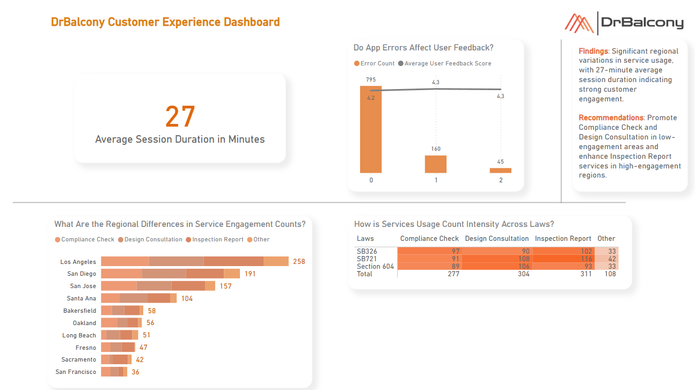

## Customer Experience Dashboard - Unguided Power BI Project

> [!NOTE]
> I used **Excel** for simulating data, **Python** for statistical analysis, and **Power BI** for visualization.

You can see the details below.



### Dataset

- I checked the company [website](https://drbalcony.com/) and simulated the data along with the help of ChatGPT.
- 1000 rows
- Columns: |  user_id  |  session_date  |  session_duration_in_minutes  |  features_used  |  user_feedback_score  |  user_location  |  app_load_time_in_seconds  |  error_occurrences  |  regulatory_focus  |
- Explanation of Columns: user_id --> 1000 unique ids, session_date --> meeting dates in 2024 with the customers for product overviews, session_duration_in_minutes --> whole positive number,
  - features_used --> Exactly one of the following: Inspection Report, Design Consultation, Compliance Check, Other
  - user_feedback_score --> randomized decimal between 3.5 and 5 (because the company has a 3.9 rating on Yelp, so I decided this way)
  - user_location --> the top 10 cities in California by population
  - app_load_time_in_seconds --> 1 with 60% probability, 2 with 38% probability, 3 with 2% probability
  - error_occurrences --> 0 with 80% probability, 1 with 15% probability, 2 with 5% probability
  - regulatory_focus --> Exactly one of the three laws for the exterior elevated elements (EEEs) in California: SB326, SB721, Section 604
- Codes for each Excel column in order:
  - ```excel
    =SEQUENCE(1000)

    =RANDBETWEEN(DATE(2024;1;1); DATE(2024;12;31))

    =RANDBETWEEN(15;40)

    =IF(TEXTJOIN(", "; TRUE; IF(RANDBETWEEN(0;1)=1; "Inspection Report"; ""); IF(RANDBETWEEN(0;1)=1; "Design Consultation";      ""); IF(RANDBETWEEN(0;1)=1; "Compliance Check"; "")) = ""; "Other"; CHOOSE(RANDBETWEEN(1;3); "Inspection Report";       
    "Design Consultation"; "Compliance Check"))

    =RANDBETWEEN(35;50) / 10

    =CHOOSE(MATCH(RAND(); {0;0.25;0.45;0.6;0.7;0.75;0.8;0.85;0.9;0.95;1}; 1); "Los Angeles"; "San Diego"; "San Jose"; "Santa 
    Ana"; "San Francisco"; "Fresno"; "Sacramento"; "Long Beach"; "Oakland"; "Bakersfield")

    =CHOOSE(MATCH(RAND(); {0;0.6;0.98;1}; 1); 1; 2; 3)

    =CHOOSE(MATCH(RAND(); {0;0.8;0.95;1}; 1); 0; 1; 2)

    =CHOOSE(RANDBETWEEN(1;3); "SB326"; "SB721"; "Section 604")
    ```

### What could be added?

- I could add dynamic sorting through DAX or bookmarks. In this way, when clicking on a particular legend on the bar chart, that sub-chart would be in descending order too.

### Thank you!
